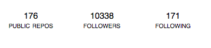
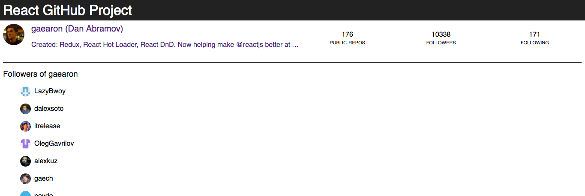
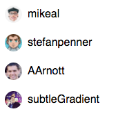
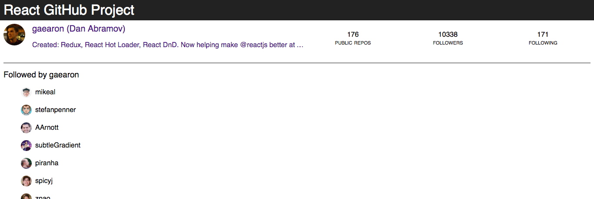
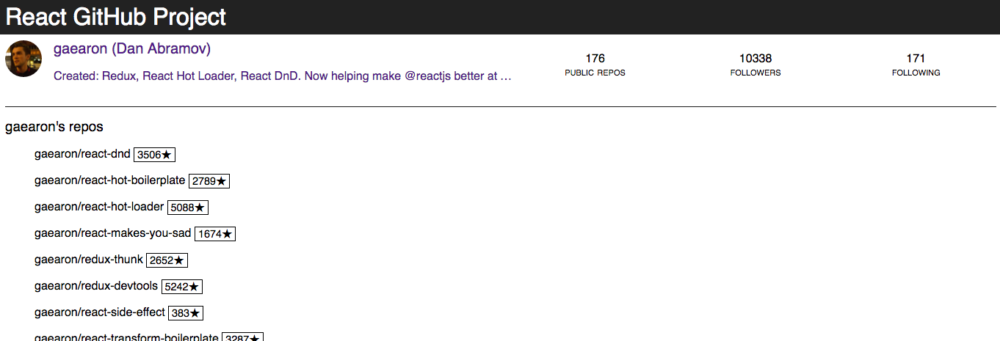
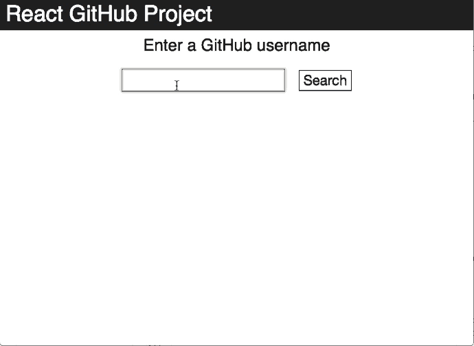

# React + GitHub API project

In this project, we're going to take a small, existing React application and add new features to it.

Here's what the application will look like once you are done:


The code you are given for the project implements the search form and the loading of basic user info. You'll have to do all the rest.

In `App.js` we have the following route structure:

```javascript
<Switch>
    <Route exact path="/" component={Search} />
    <Route path="/user/:username" component={User} />
</Switch>
```

The top route says to load the `Search` component. If the route happens to be `/user/:username`, React Router will display `<User/>`.

When the `Search` component is displayed, it has a form and a button. When the form is submitted, we use React Router's `history` to **programmatically change the URL**. Look at the `Search`'s `handleSubmit` method to see how that happens.

Once we navigate to the new URL, React Router will render a `User` component. Looking at the `useEffect` hook of the `User`, you'll see that it does an AJAX call using `props.match.params.username`. The reason it has access to this prop is because the Router passed it when it mounted the component.

The AJAX call is made to `https://api.github.com/users/{USERNAME}` and returns the following information:

```json
{
  "login": "gaearon",
  "id": 810438,
  "avatar_url": "https://avatars.githubusercontent.com/u/810438?v=3",
  "gravatar_id": "",
  "url": "https://api.github.com/users/gaearon",
  "html_url": "https://github.com/gaearon",
  "followers_url": "https://api.github.com/users/gaearon/followers",
  "following_url": "https://api.github.com/users/gaearon/following{/other_user}",
  "gists_url": "https://api.github.com/users/gaearon/gists{/gist_id}",
  "starred_url": "https://api.github.com/users/gaearon/starred{/owner}{/repo}",
  "subscriptions_url": "https://api.github.com/users/gaearon/subscriptions",
  "organizations_url": "https://api.github.com/users/gaearon/orgs",
  "repos_url": "https://api.github.com/users/gaearon/repos",
  "events_url": "https://api.github.com/users/gaearon/events{/privacy}",
  "received_events_url": "https://api.github.com/users/gaearon/received_events",
  "type": "User",
  "site_admin": false,
  "name": "Dan Abramov",
  "company": "Facebook",
  "blog": "http://twitter.com/dan_abramov",
  "location": "London, UK",
  "email": "dan.abramov@me.com",
  "hireable": null,
  "bio": "Created: Redux, React Hot Loader, React DnD. Now helping make @reactjs better at @facebook.",
  "public_repos": 176,
  "public_gists": 48,
  "followers": 10338,
  "following": 171,
  "created_at": "2011-05-25T18:18:31Z",
  "updated_at": "2016-07-28T14:41:02Z"
}
```

[GitHub API documentation for Users](https://developer.github.com/v3/users/)

In the `return` of the `User` component, we are displaying the user info based on the received result, and we have three links that don't lead anywhere for the moment:



If you click on followers, notice that the URL of the page changes to `/users/:username/followers`. If you have your dev tools open, React Router will give you an error message telling you that this route does not exist.

**The goal of this workshop** is to implement the three links above. To do this, we'll start by implementing the followers page together with step by step instructions. Then, your job will be to implement the two remaining screens and fix any bugs.

## Implementing the Followers page

When clicking on the followers link in the UI, notice that the URL changes to `/user/:username/followers`. Currently this results in a "not found" route. Let's fix this.



### Step 1: adding the route

In `App.js`, you currently have your user route setup like this:

```javascript
<Route path="user/:username" component={User} />
```

In the `User` component, we will add a *nested route*, just before the final closing `</div>` in the `return`:

```html
<Route path={`${props.match.path}/followers`} component={Followers}/>
```

(More on what this is doing in a moment, but here is [a good reference on nested routes in React](https://tylermcginnis.com/react-router-nested-routes/).)

For this to do anything, we first have to implement the `Followers` component.

### Step 2: adding the `Followers` component

Create a component called `Followers`. Since this component is also a route component, it will receive the same `props.match.params.username`. In this component, we're eventually going to do an AJAX call to grab the followers of the user.

For the moment, create the component only with a `return` function. In there, use your props to return the following:

```html
<div className="followers-page">
  <h3>Followers of USERNAME</h3>
</div>
```

### Step 3: displaying the nested component inside its parent

When the URL changes to `followers`, we want to display the followers along with the current `User` component. **This is why we are nesting the followers route inside the user route.** So we can render both routes at the same time.

Now go back to your browser. Search for a user, and click on FOLLOWERS. The followers component should be displayed below the user info.

### Step 4: loading GitHub data in the `Followers` component

We want to load the followers of the current user as soon as the `Followers` component is mounted in the DOM. In the `useEffect` hook of `Followers`, use `axios` to make a request to GitHub's API for the followers. Simply add `/followers` to the GitHub API URL for the user e.g. https://api.github.com/users/gaearon/followers

After your AJAX request, set a `followers` state on your component.

### Step 5: displaying the followers data in the `Followers` component

Using the `followers` state variable, display the followers that you receive from GitHub. We'll do this in a few steps.

1. Create a new component called `GithubUser`. It should receive a `user` prop, and use its `avatar_url` and `login` properties to display one GitHub user. The whole display should link back to that user's page in your app, using React Router's `Link` component. Here's what a sample output of your `GithubUser` component should look like:

```javascript
<Link to="/user/gaearon">
  
  gaearon
</Link>
```

And here's a visual example of four `GithubUser` instances (you can use `vertical-align` in your CSS to align the image and the name):



2. In `Followers`, import your `GithubUser` component.
3. In the `return` of `Followers`, use `map` to take the array at `followers`, and map it to an array of `<GithubUser />` elements, passing the `user` prop. The code of `Followers`' `return` should look like this:

```javascript
return !followers
    ? <div>LOADING FOLLOWERS...</div>
    : <div className="followers-page">
        <h2>Followers of {props.match.params.username}</h2>
        {followers.map(user => <GithubUser user={user} />)}
    </div>
```

Having done this, you should have a full `Followers` component ready to go.

## Implementing the following page

Implementing the following page is an exact copy of the followers page. The only differences are:

1. Use `/following` instead of `/followers` in your AJAX call
2. The title of the page and its URL will be different

When displaying the following list, note that you can -- and *should* -- reuse the same `GithubUser` presentational component.



## Implementing the repos page

Implementing the repos page is similar to the other two pages you implemented. The only differences are:

1. Use `/repos` in your AJAX call
2. Title and URL are different
3. Instead of using a `<Link>` element to link to the repo, use a regular `<a href>` since you're linking to an external resource.
4. You'll need a new `GithubRepo` component that will act similar to the `GithubUser` component you used to display the followers/following.



When you finish everything, your end-result should look and behave like this:


## Challenge: infinite scrolling!

:warning: If you're going to do this challenge, I suggest you start it in a separate branch and commit often. This way you always have somewhere to go back to when "things were working".

For this challenge, we're going to use the [`react-infinite`](https://github.com/seatgeek/react-infinite) component to load extra data from the GitHub API.

Right now, if you look at a profile with a lot of followers, you'll notice that GitHub API only returns the first 25 followers. The API has a `per_page` query string parameter that you can set, but the maximum number of items per page is still 100. If someone has more than 100 followers, you'd have to do many requests to get all of them.

React Infinite will take care of most of the heavy lifting for us. First of all, it's never a good idea to have thousands of elements on the page if the user is only seeing a handful. React Infinite will be efficient in showing only the elements that are in the viewport. Second, React Infinite will detect the scroll position and can fire off a callback when the scrolling reaches the edge of your container.

All you have to do is provide React Infinite with the callback function that will load your data, and pass your items to the `<Infinite>` component.

Let's do it step by step for **followers** and then you can reproduce it for the other pages. This is what your app will look like once you are done:



## Step 0: :eyeglasses: reading the documentation!

[Read the documentation for React Infinite](https://github.com/seatgeek/react-infinite#react-infinite) to get an idea of what's going on. Once you have read the documentation, make sure to install the `react-infinite` package.

## Step 1: modifying the `Followers` component

Your `Followers` component currently loads its data with `useEffect`. It turns out that if you mount an `<Infinite>` component without any data, it will automatically call your callback function to fetch more data.

### Step 1.1: Adding new state data to `Followers`

Add a `page` state and initialize it to `1`.

### Step 1.2: Move the `fetchData` method outside of `useEffect`

In your AJAX call, add two query string parameters to the GitHub API URL: `page` will come from your state, and `per_page` can be set to anything between 1 and 100. Set it to 50. Your URL should look like this:

```
https://api.github.com/users/USER/followers?page={page}&per_page=50
```

### Step 1.3: Change the follow-up to the AJAX call

After the AJAX call, you're currently setting the `followers` state to the response you receive from the GitHub server. Instead, since you already have a followers array, use the `concat` method to add the new items to your existing `followers` array. Additionally, set the `page` state to whatever it currently is `+ 1`.

### Step 1.4: Importing the library

Import `react-infinite` in your `Followers` component, and assign it to the variable `Infinite`.

### Step 1.5: Change the `render` method

Replace your container with an `<Infinite>` container, and pass it the following props:

* `isInfiniteLoading`: take it from `!followers`
* `onInfiniteLoad`: point to your `fetchData` method
* `useWindowAsScrollContainer`: this prop doesn't have a value! It will be set to `true` automatically
* `elementHeight`: to scroll efficiently, React Infinite needs to know the height of an element. Use your browser's inspector to find the approximate height of your `GithubUser` elements. It's not perfect, but it'll do for now.
* `infiniteLoadBeginEdgeOffset`: this sets the amount of pixels from the edge of your container at which more data will be loaded. Set it to `100` so that the data starts loading before you reach the edge (bottom) of the window.

Your `return` code should have the following in it now:

```javascript
<Infinite ...all the props...>
{
    followers.map(user =>
        <GithubUser user={user} key={user.id} />
    )
}
</Infinite>
```

After you've done all these changes, your infinite scroll should be working. React Infinite will call your `fetchData` method as often as needed to display new elements. Every time a new page is fetched, you're incrementing the `page` state so that future page fetches will fetch the next page. Since you're `concat`ing followers, your list will keep growing until there is no more data.

## Optional step: adding a loading indicator

React Infinite lets you use a [`loadingSpinnerDelegate`](https://github.com/seatgeek/react-infinite#react-node-loadingspinnerdelegate). It's basically a React element that will be displayed below the list when `loading` is `true`.

You can do this as simply as `loadingSpinnerDelegate={<div>LOADING</div>}` or you can go for a CSS animation, or even a GIF.

## Finally

When you are done, make sure to add infinite scrolling to the following and repos pages. They should work exactly the same way :)
